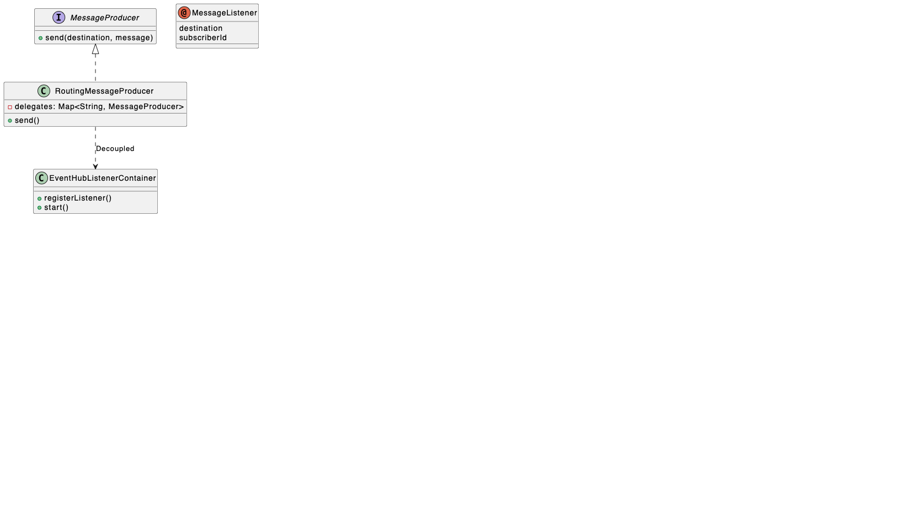

# Easy Message - Azure Event Hubs Starter
Easy Message 是一个基于 Spring Boot 的轻量级消息中间件 Starter，专为 Azure Event Hubs 设计。

它借鉴了 Eventuate Tram 的设计理念，旨在简化分布式系统中的消息生产与消费。通过对 Azure原生 SDK 的封装，提供了开箱即用的多实例路由、生命周期管理、链路追踪以及声明式消费者功能。

## ✨ 核心特性
- 📦 开箱即用：只需引入 Maven 依赖并配置 YAML，即可连接 Azure Event Hubs。
- 🔀 智能路由：支持逻辑 Destination 到物理 Event Hub 名称的映射，支持向多个不同的 Event Hub 实例发送消息。
- 🎧 声明式消费：通过 @MessageListener 注解轻松订阅消息，无需手动编写繁琐的 Client 构建代码。
- 💾 可靠的 Checkpoint：集成了 Azure Blob Storage，自动管理消费者偏移量（Offset），确保消息不丢失、不重复消费（At-least-once）。
- 🔍 链路追踪 (Tracing)：内置拦截器机制，自动注入/提取 Trace Context，方便对接分布式追踪系统。
- 🚀 生命周期管理：基于 SmartLifecycle，确保消费者在 Spring 容器完全启动后才开始处理消息。

## 🏗 架构设计
Easy Message 采用分层架构设计，将核心抽象与底层实现解耦。

### UML 类图


## 🛠 快速开始

### 1. 环境要求
- Java: 17+
- Spring Boot: 3.x
- Azure 资源:
- Event Hubs Namespace (及若干 Event Hub)
- Storage Account (用于 Checkpoint)

### 2. 引入依赖
   在你的 Spring Boot 项目 pom.xml 中添加：
```xml
<dependency>
    <groupId>com.easy.messaging</groupId>
    <artifactId>message-starter</artifactId>
    <version>1.0-SNAPSHOT</version>
</dependency>
```

### 3. 应用配置 (application.yml)
   这是最关键的一步。你需要配置 Checkpoint 存储以及具体的业务 Event Hub 实例。
```yaml
message:
  # [必须] Checkpoint 存储配置 (Azure Blob Storage)
  checkpoint-connection-string: "DefaultEndpointsProtocol=https;AccountName=your_storage;AccountKey=...;EndpointSuffix=core.windows.net"
  checkpoint-container-name: "checkpoints" # 容器会自动创建

  # [可选] 默认配置与逻辑映射
  defaults:
    destinations:
      # 逻辑名称 -> 物理 EventHub 名称
      create-order: "orders-hub"
      send-email: "notifications-hub"

  # [核心] Event Hub 实例配置
  instances:
    # 业务模块 1: 订单
    orders:
      enabled: true
      event-hub-name: "orders-hub"
      producer-connector:
        enabled: true
        connection-string: "Endpoint=sb://...;SharedAccessKeyName=...;SharedAccessKey=..."
      consumer-connector:
        enabled: true
        connection-string: "Endpoint=sb://...;SharedAccessKeyName=...;SharedAccessKey=..."
        consumer-group: "$Default" # 默认为 $Default

    # 业务模块 2: 通知
    notifications:
      enabled: true
      event-hub-name: "notifications-hub"
      # 该模块只消费，不发送
      consumer-connector:
        enabled: true
        connection-string: "Endpoint=sb://...;..."
```

## 💻 使用指南
### 1. 发送消息 (Producer)
   注入 MessageProducer 接口，使用 MessageBuilder 构建消息。
```java
@RestController
public class OrderController {

    private final MessageProducer messageProducer;

    public OrderController(MessageProducer messageProducer) {
        this.messageProducer = messageProducer;
    }

    @PostMapping("/orders")
    public String createOrder(@RequestBody String orderJson) {
        // 构建消息
        Message message = MessageBuilder.withPayload(orderJson)
                .withHeader(Message.ID, UUID.randomUUID().toString())
                .withHeader("custom-header", "value")
                .build();

        // 发送消息
        // "create-order" 是逻辑名称，会被配置解析为 "orders-hub"
        messageProducer.send("create-order", message);

        return "Order Sent";
    }
}
```
### 2. 接收消息 (Consumer)
   在任意 Spring Bean (@Component/@Service) 的方法上添加 @MessageListener 注解。

   ⚠️ 注意：方法参数必须是 com.easy.messaging.core.message.Message 类型。
```java
@Component
public class OrderService {

    private static final Logger log = LoggerFactory.getLogger(OrderService.class);

    @MessageListener(destination = "create-order", subscriberId = "order-service-consumer")
    public void handleOrderCreation(Message message) {
        String payload = message.getPayload();
        String msgId = message.getId();
        
        log.info("Received Order: ID={}, Payload={}", msgId, payload);
        
        // 处理业务逻辑...
    }
}
```

## 🧩 高级功能
### 链路追踪 (Tracing)
开启 message.tracing-enabled: true (默认开启)。
Producer 发送时会自动生成或传递 traceId 和 spanId 到 Header 中。Consumer 接收时，你可以通过 message.getHeader("traceId") 获取上下文。

### 拦截器 (Interceptor)
你可以实现 MessageInterceptor 接口并注册为 Bean，框架会自动将其加入拦截链。
```java
@Component
public class LoggingInterceptor implements MessageInterceptor {
    @Override
    public void preSend(Message message) {
        System.out.println("Before Sending: " + message.getPayload());
    }
    
    @Override
    public void postHandle(String subscriberId, Message message, Throwable t) {
        if (t != null) {
            System.err.println("Handling failed: " + t.getMessage());
        }
    }
}
```

## ⚙️ 编译与开发
本项目为多模块 Maven 项目：

- message-core: 核心接口与抽象。
- message-eventhub: Azure Event Hub SDK 的具体实现。
- message-autoconfigure: Spring Boot 自动装配逻辑。
- message-starter: 聚合模块，供用户引入。

### 本地安装:
```shell
mvn clean install
```
